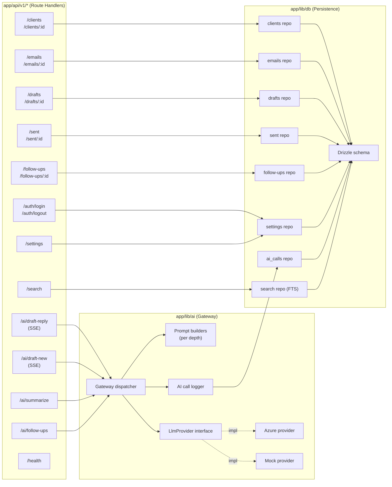
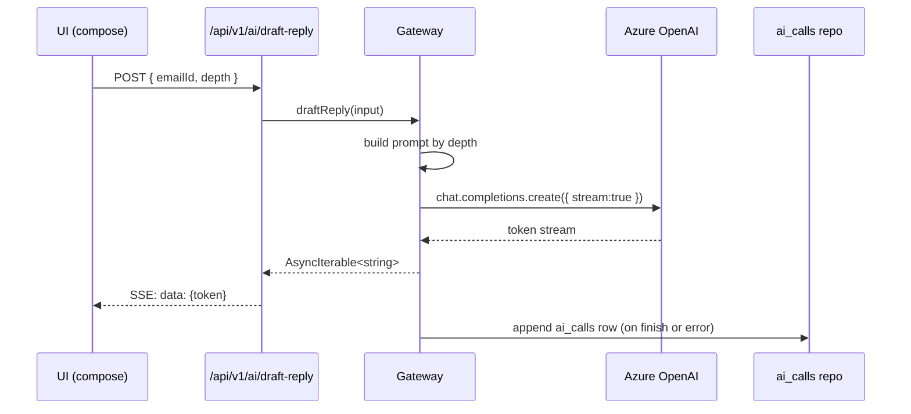

# C4 — Level 3: Components (inside the FAO Web App)

**Phase:** 3 — Design (Architecture)
**Status:** Approved
**Date:** 2026-05-24

Canonical diagram in Figma / draw.io: _TBD_.

Component view zooms into the REST API + LLM Gateway + Repository
containers.

## Draft Mermaid diagram

## Component responsibilities

### Route handlers (`app/api/v1/*/route.ts`)

Thin. Parse + validate input with Zod, call a repository or the LLM
gateway, return JSON or SSE. No business logic beyond input shape.

### LLM Gateway (`app/lib/ai/`)

| File | Role |
|---|---|
| `gateway.ts` | Dispatch entry points: `draftReply`, `draftNewEmail`, `summarizeEmail`, `suggestFollowUps`. |
| `prompts/reply.ts`, `prompts/new.ts`, `prompts/summarize.ts`, `prompts/follow-ups.ts` | Pure functions producing the structured message array per depth. |
| `providers/azure.ts` | Implements `LlmProvider` against Azure OpenAI; supports streaming. |
| `providers/mock.ts` | Deterministic mock that emits canned tokens; used in tests and dev without secrets. |
| `logger.ts` | Persists call metadata to `ai_calls` (model, depth, tokens, latency, outcome). |

### Repositories (`app/lib/db/repos/`)

| Repo | Tables | Key methods |
|---|---|---|
| `clients.ts` | `clients`, `households`, `household_members` | `getById`, `list`, `search`, `getWithHousehold` |
| `emails.ts` | `emails` | `list(folder)`, `getById`, `markRead` |
| `drafts.ts` | `drafts` | `list`, `getById`, `upsert` (autosave), `delete` |
| `sent.ts` | `sent_items` | `list`, `getById`, `create` (mock send) |
| `follow-ups.ts` | `follow_ups` | `list`, `create`, `update`, `complete` |
| `settings.ts` | `settings` | `get`, `upsert` |
| `ai-calls.ts` | `ai_calls` | `log` (append-only) |
| `search.ts` | virtual FTS table | `query(q)` returns mixed result types |

## Streaming flow detail

## Module boundaries (enforced via lint)

- `app/components/**` may not import from `app/lib/db/**` directly; all
  data access goes through Server Components + handlers.
- `app/lib/ai/**` may not import from `app/lib/db/**` except the
  `ai-calls` repo.
- `app/lib/db/repos/**` may not import each other; cross-table queries
  belong to a `joins.ts` module.
