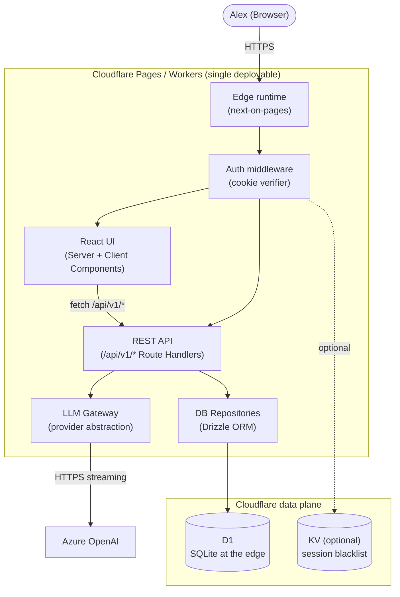

# C4 — Level 2: Containers

**Phase:** 3 — Design (Architecture)
**Status:** Approved
**Date:** 2026-05-24

Canonical diagram in Figma / draw.io: _TBD_.

## Draft Mermaid diagram

## Containers

| Container | Tech | Responsibilities |
|---|---|---|
| **Edge runtime** | `@cloudflare/next-on-pages` on Cloudflare Workers | Routes requests; serves built Next.js output; provides D1 / KV bindings to handlers. |
| **Auth middleware** | Next.js middleware (`middleware.ts`) | Verifies `fa_session` cookie HMAC; redirects unauthenticated requests to `/login`; rate-limits `/login`. |
| **React UI** | React 19 / Next.js App Router (Server + Client Components) | Renders the Outlook-style UI; streams AI responses into the compose body via Server Component + client component combination. |
| **REST API** | Next.js Route Handlers under `app/api/v1/` | Implements all CRUD endpoints (clients, emails, drafts, sent, follow-ups, settings) and AI endpoints (draft, summarize, suggest follow-ups). |
| **LLM Gateway** | Pure TypeScript module `app/lib/ai/gateway.ts` | Builds prompts per depth, calls provider, streams tokens, logs to `ai_calls`. Provider is swappable via interface. |
| **DB Repositories** | Drizzle ORM modules under `app/lib/db/repos/` | All DB access. No SQL in handlers or components. |
| **D1** | Cloudflare D1 SQLite | Stores clients, households, members, emails, drafts, sent, follow-ups, settings, ai_calls. |
| **KV (optional)** | Cloudflare KV | Reserved for future use (session revocation, feature flags). Not required for MVP. |

## Inter-container contracts

| From → To | Protocol | Format |
|---|---|---|
| Browser → Edge | HTTPS | HTML, JSON, SSE for streamed drafts |
| UI ↔ REST API | `fetch` | JSON validated by Zod schemas shared client/server |
| REST API → Repos | Function calls | Typed TS |
| Repos → D1 | Drizzle SQL | Parameterised |
| LLM Gateway → Azure | HTTPS | JSON request, server-sent events for streamed responses |

## Single deployable

The Next.js build is the entire backend; there are no sidecars and no
separate API service. Per ADR-003 + ADR-011, all server logic ships in
the same artifact deployed to Cloudflare Pages.
