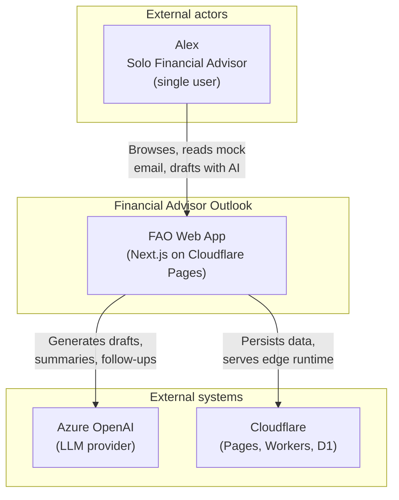

# C4 — Level 1: System Context

**Phase:** 3 — Design (Architecture)
**Status:** Approved
**Date:** 2026-05-24

Canonical diagram in Figma / draw.io: _TBD_.

## Draft Mermaid diagram

## Description

| Element | Type | Description |
|---|---|---|
| Alex | Person | The single, password-gated user. Browses the app, reads seeded emails, drafts replies and new outbound emails with AI assistance. |
| FAO Web App | System | The Next.js application. Hosts the UI, REST API, LLM gateway, and persistence. |
| Azure OpenAI | External system | Hosted LLM service used for all generative workflows. |
| Cloudflare | Infrastructure | Hosting (Pages), runtime (Workers via `next-on-pages`), database (D1), and edge networking. |

## Out of scope (deliberately not shown)

- Real Microsoft Outlook / Graph (Phase 0 D-002).
- SMTP, IMAP, or email relays.
- CRM, custodian, or market data systems.
- Archival or compliance systems (Smarsh, etc.).
