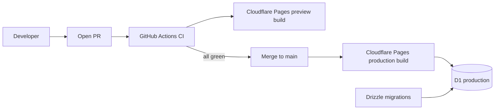

# Deployment View

**Phase:** 3 — Design (Architecture)
**Status:** Approved
**Date:** 2026-05-24

## Environments

| Env | Trigger | URL pattern | Bindings |
|---|---|---|---|
| local | `pnpm dev` or `wrangler pages dev` | `http://localhost:3000` | local D1 SQLite file; mock LLM provider |
| preview | every PR | `https://<sha>.fao-mvp.pages.dev` | preview D1; mock LLM provider (default) or Azure (flagged) |
| production | merge to `main` | `https://fao-mvp.pages.dev` (custom domain later) | production D1; Azure OpenAI |

## Deployment pipeline



- CI runs lint, typecheck, unit, integration, build, then Playwright E2E
  against the built output.
- Migrations are part of the deploy job; Wrangler applies pending D1
  migrations after a successful build.
- Rollback path: redeploy a prior Cloudflare Pages build; for DB
  rollbacks, write a forward-fixing migration (no down migrations
  guaranteed at MVP scale).

## Runtime topology

```
                    Browser (Alex)
                          |
                          v
              Cloudflare global edge
              (CF Pages serving worker)
                          |
            +-------------+--------------+
            |                            |
            v                            v
       Cloudflare D1            Azure OpenAI
       (single region)         (US East / West)
```

Notes:
- Cloudflare Workers run in the closest PoP to the user. D1 has a
  primary region; reads can be replicated to other regions in the
  paid tier (not used at MVP).
- All cross-region traffic is HTTPS.
- Cold start budget on Workers: < 100ms typical.

## Configuration and secrets

| Name | Where | Purpose |
|---|---|---|
| `SESSION_SECRET` | Pages env var (encrypted) | HMAC key for session cookies |
| `SHARED_PASSWORD` | Pages env var (encrypted) | The login gate password |
| `AZURE_OPENAI_ENDPOINT` | Pages env var | API endpoint URL |
| `AZURE_OPENAI_KEY` | Pages env var (encrypted) | API key |
| `AZURE_OPENAI_DEPLOYMENT_*` | Pages env var | Deployment names per tier (mini, flagship) |
| `LLM_PROVIDER` | Pages env var | `azure` or `mock` |
| `D1_DATABASE` | Pages binding | D1 database binding |
| `KV_NAMESPACE` (optional) | Pages binding | KV binding |

Secrets are never committed; `.env.local.example` documents required
keys for local dev.

## Domains

- MVP: `fao-mvp.pages.dev` (auto-provisioned).
- Optional custom domain: add via Cloudflare DNS once stakeholder names
  it. TLS automatic.

## Resource sizing (MVP)

- D1: well within free tier (one DB, a few MB).
- Workers requests: free tier is plenty for prototype.
- Azure OpenAI: see [budget.md](../../phase-2-planning/budget.md) §3.

## Observability

- Cloudflare access and worker logs (free).
- Optional: Sentry SDK in the Next.js client and server (free tier).
- `ai_calls` table is the source of truth for LLM cost and quality.
