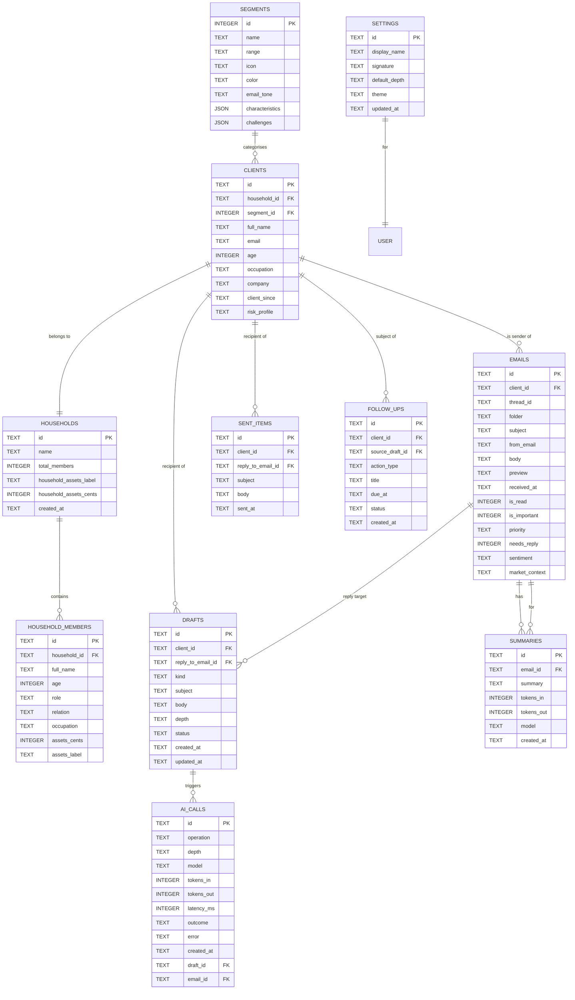

# Entity Relationship Diagram

**Phase:** 3 — Design (Data)
**Status:** Approved
**Date:** 2026-05-24

Canonical diagram in Figma / draw.io: _TBD_.

## Draft Mermaid ER diagram

---

## Table specifications

All IDs are UUIDv7 strings unless noted. Timestamps are ISO 8601 in UTC.
Money fields store integer cents to avoid float drift; `*_label` fields
keep the human-friendly string from seed data ("$72.3M").

### `segments`

Seeded only; rarely changes.

| Column | Type | Notes |
|---|---|---|
| `id` | INTEGER PK | 1..10 |
| `name` | TEXT NOT NULL | e.g., "Ultra High Net Worth" |
| `range` | TEXT NOT NULL | e.g., "$50M+" |
| `icon` | TEXT | FontAwesome class string (legacy; map to lucide icon name in UI) |
| `color` | TEXT | Tailwind color token name |
| `email_tone` | TEXT NOT NULL | e.g., "sophisticated" |
| `characteristics` | TEXT NOT NULL | JSON array of strings |
| `challenges` | TEXT NOT NULL | JSON array of strings |

### `households`

| Column | Type | Notes |
|---|---|---|
| `id` | TEXT PK | UUIDv7 |
| `name` | TEXT | e.g., "Sterling Family" |
| `total_members` | INTEGER NOT NULL | denormalised count |
| `household_assets_cents` | INTEGER | denormalised total |
| `household_assets_label` | TEXT | human-friendly string |
| `created_at` | TEXT NOT NULL | ISO 8601 |

### `household_members`

| Column | Type | Notes |
|---|---|---|
| `id` | TEXT PK | UUIDv7 |
| `household_id` | TEXT FK | → `households.id` |
| `full_name` | TEXT NOT NULL | |
| `age` | INTEGER | |
| `role` | TEXT | "Primary Client", "Spouse", etc. |
| `relation` | TEXT | "Self", "Wife", "Son", etc. |
| `occupation` | TEXT | |
| `assets_cents` | INTEGER | |
| `assets_label` | TEXT | |

### `clients`

| Column | Type | Notes |
|---|---|---|
| `id` | TEXT PK | UUIDv7 |
| `household_id` | TEXT FK | → `households.id` |
| `segment_id` | INTEGER FK | → `segments.id` |
| `full_name` | TEXT NOT NULL | |
| `email` | TEXT NOT NULL UNIQUE | matched against incoming `from_email` |
| `age` | INTEGER | |
| `occupation` | TEXT | |
| `company` | TEXT | |
| `client_since` | TEXT | "March 2018" or ISO date |
| `risk_profile` | TEXT | "Conservative", "Moderate", "Aggressive" |

Indexes: `idx_clients_email` UNIQUE on `email`; `idx_clients_segment` on
`segment_id`.

### `emails`

| Column | Type | Notes |
|---|---|---|
| `id` | TEXT PK | UUIDv7 |
| `client_id` | TEXT FK NULL | → `clients.id`; nullable for unmatched mail |
| `thread_id` | TEXT | groups replies |
| `folder` | TEXT NOT NULL | `inbox` \| `junk` \| `archive` \| `deleted` |
| `subject` | TEXT NOT NULL | |
| `from_email` | TEXT NOT NULL | |
| `body` | TEXT NOT NULL | |
| `preview` | TEXT | denormalised first ~140 chars |
| `received_at` | TEXT NOT NULL | ISO 8601 |
| `is_read` | INTEGER NOT NULL DEFAULT 0 | bool 0/1 |
| `is_important` | INTEGER NOT NULL DEFAULT 0 | |
| `priority` | TEXT | "High" \| "Medium" \| "Low" |
| `needs_reply` | INTEGER NOT NULL DEFAULT 0 | |
| `sentiment` | TEXT | enrichment from seed |
| `market_context` | TEXT | enrichment from seed |

Indexes: `idx_emails_client` on `client_id`; `idx_emails_folder_time`
on `(folder, received_at DESC)`; FTS virtual table over `subject`,
`from_email`, `body`.

### `summaries`

Cache for FR-SUM-3.

| Column | Type | Notes |
|---|---|---|
| `id` | TEXT PK | |
| `email_id` | TEXT FK UNIQUE | → `emails.id`; one summary per email |
| `summary` | TEXT NOT NULL | |
| `tokens_in` | INTEGER | |
| `tokens_out` | INTEGER | |
| `model` | TEXT | |
| `created_at` | TEXT NOT NULL | |

### `drafts`

| Column | Type | Notes |
|---|---|---|
| `id` | TEXT PK | |
| `client_id` | TEXT FK NULL | recipient client |
| `reply_to_email_id` | TEXT FK NULL | → `emails.id` for reply/forward |
| `kind` | TEXT NOT NULL | `reply` \| `reply_all` \| `forward` \| `new` |
| `subject` | TEXT | |
| `body` | TEXT | |
| `depth` | TEXT | `light` \| `medium` \| `deep` |
| `status` | TEXT NOT NULL DEFAULT `open` | `open` \| `sent` \| `discarded` |
| `created_at` | TEXT NOT NULL | |
| `updated_at` | TEXT NOT NULL | bumped on every autosave |

Indexes: `idx_drafts_status_updated` on `(status, updated_at DESC)`.

### `sent_items`

| Column | Type | Notes |
|---|---|---|
| `id` | TEXT PK | |
| `client_id` | TEXT FK | |
| `reply_to_email_id` | TEXT FK NULL | |
| `subject` | TEXT NOT NULL | |
| `body` | TEXT NOT NULL | |
| `sent_at` | TEXT NOT NULL | |

### `follow_ups`

| Column | Type | Notes |
|---|---|---|
| `id` | TEXT PK | |
| `client_id` | TEXT FK | |
| `source_draft_id` | TEXT FK NULL | |
| `action_type` | TEXT NOT NULL | enum: `schedule_meeting`, `send_brief`, `reminder` |
| `title` | TEXT NOT NULL | "Schedule Q4 review" |
| `due_at` | TEXT NULL | ISO 8601 |
| `status` | TEXT NOT NULL DEFAULT `open` | `open` \| `done` \| `snoozed` |
| `created_at` | TEXT NOT NULL | |

Indexes: `idx_followups_client_status` on `(client_id, status)`.

### `ai_calls`

Append-only log; one row per provider call.

| Column | Type | Notes |
|---|---|---|
| `id` | TEXT PK | |
| `operation` | TEXT NOT NULL | `draft_reply` \| `draft_new` \| `summarize` \| `suggest_follow_ups` |
| `depth` | TEXT NULL | only for draft ops |
| `model` | TEXT NOT NULL | provider deployment name |
| `tokens_in` | INTEGER | |
| `tokens_out` | INTEGER | |
| `latency_ms` | INTEGER | |
| `outcome` | TEXT NOT NULL | `success` \| `error` |
| `error` | TEXT NULL | error class / message (truncated) |
| `created_at` | TEXT NOT NULL | |
| `draft_id` | TEXT FK NULL | |
| `email_id` | TEXT FK NULL | |

### `settings`

Single-row table (single-user prototype).

| Column | Type | Notes |
|---|---|---|
| `id` | TEXT PK | always `singleton` |
| `display_name` | TEXT | |
| `signature` | TEXT | |
| `default_depth` | TEXT DEFAULT `medium` | |
| `theme` | TEXT DEFAULT `system` | |
| `updated_at` | TEXT NOT NULL | |

---

## Migration strategy

- All schema lives in `app/lib/db/schema.ts` (Drizzle).
- `pnpm drizzle-kit generate` produces SQL files in `app/lib/db/migrations/`.
- Migrations are applied during CD via Wrangler.
- Seed data lives in `app/lib/db/seed/*.ts`. A `pnpm seed` command runs
  on first deploy and is idempotent (uses `INSERT OR IGNORE` keyed by
  natural keys for segments and the singleton settings row; clients use
  fixed UUIDs).
