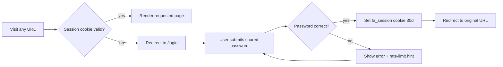
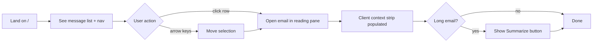
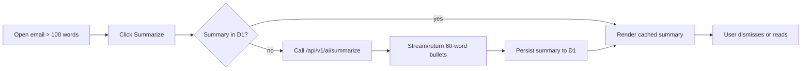
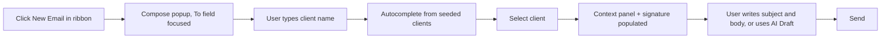
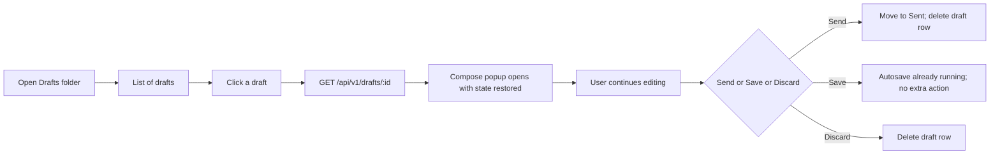
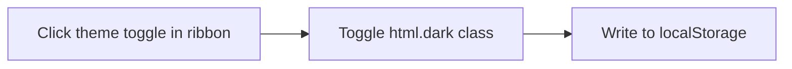

# User Flows

**Phase:** 3 — Design (UX)
**Status:** Approved
**Date:** 2026-05-24

Canonical flow diagrams will live in Figma; the diagrams below are
authoritative drafts until the Figma file is published. Each flow is
referenced by user stories in
[user-stories.md](../../phase-1-requirements/user-stories.md).

---

## Flow 1 — Login

User story: implicit (ADR-007).



---

## Flow 2 — Triage Inbox and Read

User stories: US-1.1, US-1.2, US-1.3.



---

## Flow 3 — Summarize a Long Email

User stories: US-3.1, US-3.2.



---

## Flow 4 — AI-Drafted Reply (happy path)

User stories: US-2.1, US-2.2, US-2.3, US-2.4.

```mermaid
flowchart LR
    A[Open email] --> B[Click Reply]
    B --> C[Compose popup opens with client context]
    C --> D[User picks depth Light/Medium/Deep]
    D --> E[Click AI Draft]
    E --> F[POST /api/v1/ai/draft-reply]
    F --> G[Stream tokens into compose body]
    G --> H[User edits or regenerates]
    H --> I[Suggested follow-ups appear in side panel]
    I --> J[Click Send]
    J --> K[POST /api/v1/sent]
    K --> L[Compose closes; Sent Items updated]
```



Failure branches:

- LLM 5xx or timeout → show retry CTA; user can change depth and retry.
- D1 write fails on autosave → toast warning; in-memory state preserved.
- D1 write fails on Send → block close; show retry; do not lose body.

---

## Flow 5 — New Outbound Email

User story: US-2.5.



---

## Flow 6 — Accept a Follow-Up

User stories: US-4.1, US-4.2, US-4.3.

```mermaid
flowchart LR
    A[Draft generated] --> B[Suggestions card lists up to 3 follow-ups]
    B --> C[User clicks Add on a suggestion]
    C --> D[POST /api/v1/follow-ups]
    D --> E[Toast: added]
    E --> F[Counter on Follow-ups nav increments]
    F --> G[User can navigate to /follow-ups]
    G --> H[List grouped by client]
    H --> I[Mark Done → PATCH /api/v1/follow-ups/:id]
```



---

## Flow 7 — Resume a Saved Draft

User stories: US-5.2.



---

## Flow 8 — Search

User story: US-1.5.

```mermaid
flowchart LR
    A[Type in search box] --> B[Debounced GET /api/v1/search?q=...]
    B --> C{Empty result?}
    C -- yes --> D[Show "no matches"]
    C -- no --> E[Render results: emails, clients, follow-ups]
    E --> F[User clicks result] --> G[Navigate to deep link]
```

---

## Flow 9 — Theme Toggle

User story: US-6.1.



---

## Edge cases catalog

- Network offline: drafts queue in memory; banner indicates "offline";
  autosave retries on reconnect.
- D1 unavailable: read-only mode banner; compose disabled.
- LLM unavailable: AI Draft button disabled with tooltip; manual compose
  still works.
- Session expired: redirect to /login, preserve return-to URL.
- Compose window closed without sending: confirmation modal if there are
  unsaved changes (after debounce window).
